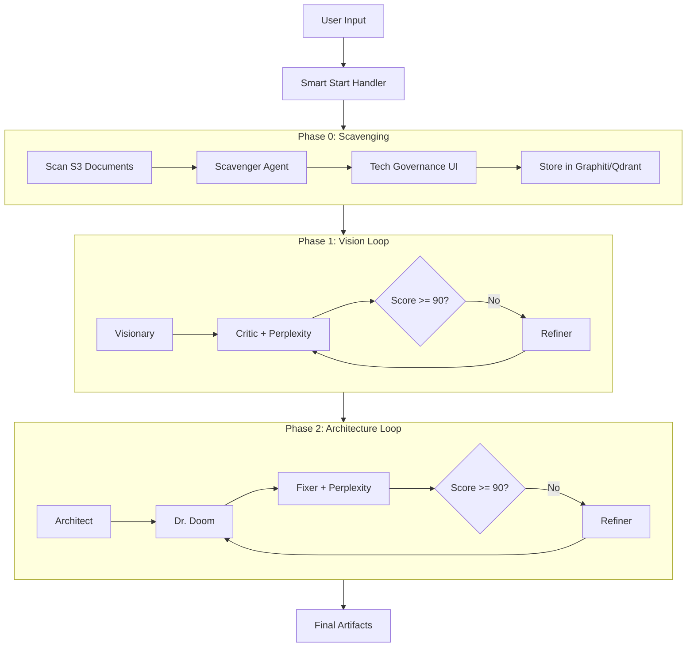

# AI Product Factory - Claude Integration Guide

## Table of Contents

- [Overview](#overview)
- [Quick Start](#quick-start)
- [Architecture](#architecture)
- [MCP Setup](#mcp-setup)
- [Workflows](#workflows)
- [Dashboard](#dashboard)
- [Database Migrations](#database-migrations)
- [Testing](#testing)
- [Troubleshooting](#troubleshooting)
- [Reference](#reference)

---

## Overview

The **AI Product Factory** is an n8n-based AI orchestration system that generates comprehensive **Product Vision** and **Architecture** documents through multi-phase, collaborative AI agent workflows.

**Version**: v3.0.4 (2026-01-18)

### Key Capabilities

| Feature | Description |
|---------|-------------|
| **Multi-Agent Collaboration** | 7 specialized AI agents (Visionary, Architect, Critic, Dr. Doom, Scavenger, Refiner, Fixer) |
| **Adversarial Refinement** | Creator → Critic → Refiner loops with quality scoring |
| **Knowledge Management** | Graphiti (knowledge graph) + Qdrant (vector database) |
| **Human-in-the-Loop** | Batch governance UI for tech stack approval |
| **Resumable State** | S3-based state persistence with Smart Start |
| **Research Integration** | Perplexity for fact-checking and risk research |
| **Dashboard UI** | React app with Google OAuth, ADR viewer, artifact management |
| **Setup Wizard** | 6-step guided n8n integration configuration |

---

## Quick Start

### 1. Start a Project (Dashboard)

1. Navigate to `/projects/new`
2. Enter project name and description
3. Drag-and-drop source documents (PDF, MD, DOCX)
4. Click "Start Project"

### 2. Start a Project (API)

```bash
curl -X POST https://dashboard.example.com/api/start-project \
  -H "Content-Type: application/json" \
  -d '{"projectName": "MyApp", "projectId": "myapp-123", "inputFiles": [...]}'
```

### 3. Essential Commands

```bash
# Test commands
npm run test:all              # Full test suite
npm run test:integration      # Integration tests (79 tests)
npm run test:frontend         # Frontend tests

# Workflow sync
npm run sync-workflows        # Push workflows to n8n
npm run sync-workflows:dry-run

# Production parity testing
npm run test:local-prod:up    # Start local prod environment
npm run test:local-prod:validate
```

---

## Architecture

### Workflow Phases



### Agents

| Agent | Model | Temp | Purpose |
|-------|-------|------|---------|
| **Scavenger** | Claude Sonnet 3.5 | 0.2 | Extract tech standards from documents |
| **Visionary** | Claude Sonnet 3.5 | 0.7 | Draft Product Vision with JTBD |
| **Architect** | Claude Sonnet 3.5 | 0.5 | Design ARC42 architecture |
| **Critic** | GPT-4o | 0.3 | Red-team analysis with fact-checking |
| **Dr. Doom** | GPT-4o | 0.2 | Pre-mortem risk analysis |
| **Refiner** | Claude Sonnet 3.5 | 0.5 | Improve based on feedback |
| **Fixer** | Perplexity Sonar | 0.5 | Research best practices for risks |

### S3 Storage Structure

```
product-factory-artifacts/
└── projects/{project_id}/
    ├── input/           # User-uploaded documents
    ├── artifacts/       # Generated docs (ProductVision_FINAL.md, Architecture_FINAL.md)
    ├── state/           # project_state.json (resumable)
    ├── iterations/      # Version history per session
    └── standards/       # Approved tech standards (global/local)
```

---

## MCP Setup

### Prerequisites

1. n8n instance running at `https://c3po.etrox.de`
2. MCP access enabled in n8n (Settings → Instance-level MCP)
3. Workflows imported and marked "Available in MCP"
4. Required credentials configured

### MCP Configuration

Create `.mcp.json` in project root or `~/.claude.json` for user scope:

```json
{
  "mcpServers": {
    "n8n-mcp": {
      "command": "npx",
      "args": ["n8n-mcp"],
      "env": {
        "MCP_MODE": "stdio",
        "LOG_LEVEL": "error",
        "DISABLE_CONSOLE_OUTPUT": "true",
        "N8N_API_URL": "https://c3po.etrox.de",
        "N8N_API_KEY": "${N8N_API_KEY}"
      }
    },
    "context7": { "url": "https://mcp.context7.com/mcp" },
    "Playwright": { "command": "npx @playwright/mcp@latest" },
    "firecrawl-mcp": {
      "command": "npx", "args": ["-y", "firecrawl-mcp"],
      "env": { "FIRECRAWL_API_KEY": "${FIRECRAWL_API_KEY}" }
    },
    "perplexity": {
      "command": "npx", "args": ["-y", "@perplexity-ai/mcp-server"],
      "env": { "PERPLEXITY_API_KEY": "${PERPLEXITY_API_KEY}" }
    },
    "Ref": { "type": "http", "url": "https://api.ref.tools/mcp?apiKey=${REF_API_KEY}" },
    "semgrep": { "type": "streamable-http", "url": "https://mcp.semgrep.ai/mcp" },
    "shadcn": { "command": "npx", "args": ["shadcn@latest", "mcp"] }
  }
}
```

**After configuration**: Restart Claude Code and verify with "What n8n workflows are available?"

---

## Workflows

### Workflow Files

| Workflow | Purpose |
|----------|---------|
| `ai-product-factory-main-workflow.json` | Main orchestrator with Smart Start |
| `ai-product-factory-api-workflow.json` | API webhooks (start-project, governance-batch) |
| `ai-product-factory-scavenging-subworkflow.json` | Phase 0: Context extraction |
| `ai-product-factory-vision-loop-subworkflow.json` | Phase 1: Product Vision |
| `ai-product-factory-architecture-loop-subworkflow.json` | Phase 2: ARC42 Architecture |
| `ai-product-factory-perplexity-research-subworkflow.json` | Perplexity research tool |
| `ai-product-factory-decision-logger-subworkflow.json` | Paper trail logging |
| `ai-product-factory-s3-subworkflow.json` | S3 operations |

### Required Credentials

| Credential | Type | Purpose |
|------------|------|---------|
| `OpenRouter API` | OpenRouter | All LLM agents |
| `OpenAI API Header` | HTTP Header | Embeddings for Qdrant |
| `Zep Api account` | Zep | Agent memory |

### Environment Variables

```bash
# Infrastructure
GRAPHITI_URL=http://graphiti:8000
QDRANT_URL=http://qdrant:6333
S3_ENDPOINT=http://seaweedfs:8333
S3_BUCKET=product-factory-artifacts
S3_ACCESS_KEY=your-access-key
S3_SECRET_KEY=your-secret-key

# Workflow Configuration
FACTORY_MAX_ITERATIONS=5
FACTORY_SCORE_THRESHOLD=90
FACTORY_BATCH_SIZE=3
FACTORY_CONFIRMATION_TIMEOUT=3600

# Model Configuration (via OpenRouter)
MODEL_ARCHITECT=anthropic/claude-sonnet-3.5
MODEL_CRITIC=openai/gpt-4o
MODEL_REFINER=anthropic/claude-sonnet-3.5
MODEL_CONTEXT=google/gemini-1.5-pro
MODEL_RESEARCH=perplexity/sonar-pro
```

### Perplexity Research Types

```
fact_check        → Verify claims with citations
market_research   → Market trends, key players
best_practices    → Industry best practices
risk_mitigation   → Mitigation strategies and case studies
competitive_analysis → Competitor intelligence
```

### Editing Workflows

**IMPORTANT**: After editing any workflow JSON file, you MUST validate the changes:

```bash
# Quick validation (unit tests only - no n8n required)
npm run test:workflows

# Full validation with n8n import test (requires test environment)
npm run test:env:up
N8N_API_KEY=<your-key> npm run test:workflows
npm run test:env:down
```

**What the tests validate:**
- All 8 workflow files exist and are valid JSON
- Required fields: `name`, `nodes`, `connections`
- Node structure: `id`, `name`, `type`, `typeVersion`, `position`, `parameters`
- Unique node IDs and names within each workflow
- Credentials are stripped for fresh imports
- Forbidden API fields are removed (`tags`, `active`, `pinData`, etc.)
- Actual import/update to n8n API succeeds

**Common workflow editing mistakes:**
| Mistake | Result | Fix |
|---------|--------|-----|
| Including `tags` with IDs | `tags is read-only` error | Remove tags or use name-only format |
| Duplicate node IDs | Import fails silently | Ensure unique IDs |
| Invalid node type | Workflow won't execute | Check n8n node documentation |
| Missing `settings` | API may reject | Include `settings: { executionOrder: "v1" }` |

---

## Dashboard

### Technology Stack

| Technology | Purpose |
|------------|---------|
| TanStack Start | Full-stack React framework with SSR |
| Better-Auth | Google OAuth authentication |
| Shadcn UI | Component library |
| PostgreSQL | Project state storage |
| SeaweedFS | S3-compatible artifact storage |

### API Endpoints

| Endpoint | Method | Description |
|----------|--------|-------------|
| `/api/health` | GET | Health check |
| `/api/start-project` | POST | Create project and trigger workflow |
| `/api/presigned-url` | POST | S3 presigned URL for upload |
| `/api/governance` | POST | Submit governance decisions |
| `/api/setup/status` | GET | Setup wizard status (public) |
| `/api/setup/n8n/test-connection` | POST | Test n8n connectivity |
| `/api/setup/workflows/import` | POST | Import workflows to n8n |
| `/api/settings/n8n` | GET/PUT | Manage n8n settings |

### Setup Wizard

6-step wizard at `/setup/*` for fresh deployments:

1. **Welcome**: Prerequisites check
2. **Connect**: Enter n8n URL + API key
3. **Import**: Import workflows with progress
4. **Webhooks**: Auto-detect webhook URLs
5. **Verify**: Test all connections
6. **Complete**: Success summary

### Running the Dashboard

```bash
cd frontend
npm install
npm run dev     # Development (port 3000)
npm run build   # Production build
npm run start   # Start production server
```

---

## Database Migrations

### Automatic Migration System

Database migrations run **automatically** on deployment via an init container pattern. No manual SQL scripts or migration commands are needed.

```
┌─────────────┐     ┌─────────────┐     ┌─────────────┐
│  PostgreSQL │────▶│  Migration  │────▶│  Frontend   │
│  (healthy)  │     │  Service    │     │  Dashboard  │
└─────────────┘     └─────────────┘     └─────────────┘
                    exits with code 0
                    (service_completed_successfully)
```

### How It Works

1. **PostgreSQL starts** and becomes healthy
2. **Migration service** (`Dockerfile.migrate`) runs `db-migrate.mjs`
3. **Creates all tables** idempotently (`CREATE TABLE IF NOT EXISTS`)
4. **Exits with code 0** on success
5. **Frontend starts** only after migration completes (`depends_on: condition: service_completed_successfully`)

### Tables Created

| Category | Tables | Purpose |
|----------|--------|---------|
| **Better-Auth** | `user`, `session`, `account`, `verification` | OAuth authentication |
| **Setup Wizard** | `app_settings`, `workflow_registry` | Configuration storage |
| **Project State** | `project_state`, `decision_log_entries`, `chat_messages` | Workflow tracking |

### Database Functions

| Function | Purpose |
|----------|---------|
| `get_setting(key)` | Retrieve setting from app_settings |
| `set_setting(key, value, ...)` | Upsert setting to app_settings |
| `is_n8n_configured()` | Check if n8n API is configured |
| `is_setup_complete()` | Check if setup wizard completed |

### Key Files

| File | Purpose |
|------|---------|
| `frontend/Dockerfile.migrate` | Lightweight migration container |
| `frontend/scripts/db-migrate.mjs` | Migration script (idempotent) |
| `frontend/scripts/startup-recovery.mjs` | Resets stuck imports on startup |
| `frontend/docker-entrypoint.sh` | Startup script with `SKIP_MIGRATIONS` support |
| `init-scripts/00-aaa-create-databases.sql` | Creates `dashboard` database |

### Auto-Recovery

On every container startup, the system automatically:
1. **Resets stuck imports**: Workflows stuck in "importing"/"updating" status are reset to "pending"
2. **Logs recovery actions**: Any recovered workflows are logged for visibility

This handles the case where the container was restarted during a workflow import, preventing workflows from being stuck forever.

### Adding New Migrations

To add new tables or modify schema:

1. **Edit** `frontend/scripts/db-migrate.mjs`
2. **Add table** to appropriate SQL constant (`MIGRATION_SQL`, `SETUP_WIZARD_SQL`, or `PROJECT_STATE_SQL`)
3. **Add table name** to the corresponding check array (`BETTER_AUTH_TABLES`, `SETUP_WIZARD_TABLES`, or `PROJECT_STATE_TABLES`)
4. **Use idempotent SQL**: `CREATE TABLE IF NOT EXISTS`, `CREATE OR REPLACE FUNCTION`, `DROP TRIGGER IF EXISTS`

Example:
```javascript
// In db-migrate.mjs
const MY_NEW_TABLES = ['my_table'];

const MY_NEW_SQL = `
CREATE TABLE IF NOT EXISTS my_table (
    id UUID PRIMARY KEY DEFAULT gen_random_uuid(),
    name VARCHAR(255) NOT NULL,
    created_at TIMESTAMP WITH TIME ZONE DEFAULT NOW()
);
CREATE INDEX IF NOT EXISTS idx_my_table_name ON my_table(name);
`;
```

### Manual Migration (Development)

For local development without Docker:

```bash
cd frontend
npm run db:migrate          # Run migrations
npm run start:migrate       # Run migrations + start server
```

### Troubleshooting Migrations

| Problem | Solution |
|---------|----------|
| Migration hangs | Check PostgreSQL is healthy: `docker compose ps` |
| "Database does not exist" | Ensure `init-scripts/` is mounted and ran |
| "Wrong database (n8n tables found)" | Check `DATABASE_URL` points to `dashboard` database, not `n8n` |
| Migration fails on restart | Check previous migration container logs: `docker compose logs migration` |

### Environment Variables

| Variable | Purpose |
|----------|---------|
| `DATABASE_URL` | PostgreSQL connection string (must point to `dashboard` database) |
| `SKIP_MIGRATIONS` | Set to `true` in frontend when using init container pattern |

---

## Testing

### Test Commands

| Command | Description |
|---------|-------------|
| `npm run test:all` | Full test cycle: start env → test → cleanup |
| `npm run test:backend` | Backend tests only |
| `npm run test:workflows` | Validate workflow JSON files (94 tests) |
| `npm run test:workflows:integration` | Workflow import tests (requires n8n) |
| `npm run test:frontend` | Frontend tests only |
| `npm run test:integration` | Integration tests (79 tests) |
| `npm run test:e2e` | E2E tests |
| `npm run test:env:up` | Start test Docker environment |
| `npm run test:env:down` | Stop test environment |

### Test Structure

```
tests/
├── backend.test.ts           # Backend unit tests
├── workflow-import.test.ts   # Workflow file validation (94 tests)
├── n8n-integration.test.ts   # n8n API tests
├── production-parity.test.ts # Production parity tests
├── integration/              # Integration suite (79 tests)
│   ├── 01-file-upload.test.ts
│   ├── 02-project-creation.test.ts
│   ├── 03-governance-flow.test.ts
│   └── ...
└── helpers/                  # Test utilities

frontend/tests/
├── setup.ts                  # Vitest setup with Radix UI mocks
├── GovernanceWidget.test.tsx # 24 tests
└── request-context.test.ts   # 26 tests
```

### Testing Best Practices

**Critical test scenarios:**
- Fresh instance deployment (no pre-existing state)
- Failure/catch paths (variables accessible in catch blocks)
- Database constraints (NULL, foreign keys)
- External API errors (400, 401, 500 handling)

---

## Troubleshooting

### MCP Connection Issues

| Problem | Solution |
|---------|----------|
| "n8n-mcp server not responding" | 1. Verify n8n accessible 2. Check MCP enabled in n8n 3. Regenerate token 4. Restart Claude Code |
| "Workflow not found" | Mark workflows "Available in MCP" in n8n |
| "Credential not found: OpenAI API" | Create credentials with exact names (case-sensitive) |

### Workflow Errors

| Problem | Solution |
|---------|----------|
| "Graphiti connection refused" | Check `GRAPHITI_URL` env var, verify container network |
| "Qdrant authentication failed" | Set `QDRANT_API_KEY` or leave empty if no auth |
| "Embedding generation failed" | Verify `OpenAI API Header` credential |
| "Subworkflow returns no data" | Update to v2.2.0+, ensure subworkflows are "Active" |

### Database Errors

| Problem | Solution |
|---------|----------|
| `is_setup_complete() does not exist` | Update to v3.0.1+ (includes fallback implementations) |
| PostgreSQL version mismatch | Rename volume to force fresh init for PostgreSQL 18 |

### Dokploy Deployment

| Problem | Solution |
|---------|----------|
| Port already allocated | Remove explicit port mappings (Traefik handles routing) |
| Module not found | Install prod dependencies in Dockerfile runner stage |
| npm ci lock mismatch | Run `rm -rf node_modules package-lock.json && npm install` locally |
| SeaweedFS meta_aggregator errors | Add `-filer=false` to command |
| Google OAuth redirect mismatch | Set `AUTH_URL` to exact dashboard domain |

### Docker Health Checks

| Service | Health Check | Notes |
|---------|--------------|-------|
| **n8n** | `wget -qO- http://127.0.0.1:5678/healthz` | |
| **PostgreSQL** | `pg_isready -U ${USER} -d ${DB}` | |
| **Redis** | `redis-cli ping` | |
| **Qdrant** | `bash -c '(echo > /dev/tcp/localhost/6333)'` | No curl/wget available |
| **Graphiti** | `curl -sf http://127.0.0.1:8000/health` | Use `:standalone` tag for FalkorDB |
| **SeaweedFS** | `wget -qO- http://127.0.0.1:9333/cluster/status` | Use master port (9333), not S3 port |

**Start periods**: PostgreSQL/n8n/SeaweedFS: 30s | Graphiti: 90s | Redis/Qdrant/FalkorDB: 5-10s

---

## Reference

### Codebase Structure

```
ai-product-factory/
├── frontend/                 # Dashboard application
│   ├── app/routes/          # TanStack file-based routing
│   │   ├── api/             # API routes
│   │   ├── setup/           # Setup wizard pages
│   │   ├── settings/        # Settings pages
│   │   └── projects/        # Project pages
│   ├── components/          # React components
│   │   ├── error/           # RouteErrorBoundary
│   │   ├── governance/      # GovernanceWidget
│   │   ├── loading/         # Skeletons
│   │   ├── setup/           # Wizard components
│   │   └── ui/              # Shadcn components
│   ├── lib/                 # Utilities
│   │   ├── auth.ts          # Better-Auth config
│   │   ├── db.ts            # PostgreSQL client
│   │   ├── s3.ts            # SeaweedFS client
│   │   ├── n8n.ts           # n8n webhook client
│   │   ├── n8n-api.ts       # n8n REST API client
│   │   ├── settings.ts      # App settings CRUD
│   │   ├── encryption.ts    # AES-256-GCM encryption
│   │   └── logger.ts        # Structured logging
│   └── tests/               # Frontend tests
├── tests/                   # Backend integration tests
├── scripts/                 # Utility scripts
├── init-scripts/            # Database init SQL
├── workflows/               # n8n workflow definitions
├── docker-compose.test.yml  # Test environment
└── docker-compose.local-prod.yml # Production parity testing
```

### Cost & Performance

| Phase | Duration | Cost (est.) |
|-------|----------|-------------|
| Phase 0 (Scavenger) | 2-5 min | $0.005 |
| Phase 1 (Vision) | 5-15 min | ~$0.04 |
| Phase 2 (Architecture) | 5-15 min | ~$0.05 |
| Audit | 1-3 min | $0.01 |
| **Total** | **15-40 min** | **~$0.10** |

**Optimizations**: Claude Haiku for extraction: 40% cheaper | Limit iterations: 30% cheaper | Prompt caching: up to 90% savings

### Context Optimization

```bash
# Enable on-demand MCP tool loading (saves ~32k tokens)
export ENABLE_EXPERIMENTAL_MCP_CLI=true
export MAX_MCP_OUTPUT_TOKENS=50000
```

| Command | Purpose |
|---------|---------|
| `/context` | View token usage |
| `/compact` | Compress history (use at 70% capacity) |
| `/clear` | Reset context (use between unrelated tasks) |

### Security

| Service | Key Type | Priority |
|---------|----------|----------|
| n8n | JWT Token | 🔴 Critical |
| OpenAI/OpenRouter | API Key | 🔴 Critical |
| Firecrawl, Exa, Perplexity | API Key | 🟡 Medium |

**Best practices**:
- Never commit `.mcp.json` with tokens
- Rotate tokens every 90 days
- Use user-scoped config (`~/.claude.json`) for personal tokens
- Set billing alerts on all API services

### Version History

| Version | Date | Changes |
|---------|------|---------|
| v3.0.4 | 2026-01-18 | Workflow import tests (94 tests), fixed tags read-only error |
| v3.0.3 | 2026-01-18 | Automatic database migrations via init container pattern |
| v3.0.2 | 2026-01-18 | Integration test suite (79 tests), EXPERT_CONTEXT.md |
| v3.0.1 | 2026-01-16 | Resilient database queries with fallbacks |
| v3.0.0 | 2026-01-16 | Setup wizard, encrypted API key storage |
| v2.9.0 | 2026-01-15 | Route error boundaries, loading skeletons, toasts |
| v2.8.x | 2026-01-14-15 | Auto-bootstrap, production parity testing, logging |
| v2.7.0 | 2026-01-14 | S3-only storage (removed Google Drive) |
| v2.6.0 | 2026-01-14 | Batch governance UI |

See `EXPERT_CONTEXT.md` for comprehensive system documentation.

### Important URLs

- **n8n Instance**: https://c3po.etrox.de
- **n8n Docs**: https://docs.n8n.io/advanced-ai/
- **OpenAI Platform**: https://platform.openai.com

### Support

1. Check this guide's [Troubleshooting](#troubleshooting) section
2. Review `EXPERT_CONTEXT.md` for system overview
3. Check `workflows/README.md` for workflow details
4. n8n Community: https://community.n8n.io

---

**Ready to get started?** Configure MCP, then ask Claude: "What n8n workflows are available?"
