# Titan Workflow Suite - Claude Integration Guide

## Overview

The **Titan Workflow Suite** is a sophisticated n8n-based AI orchestration system that automatically generates comprehensive **Product Vision** and **Architecture** documents through multi-phase, collaborative AI agent workflows.

### What It Does

This system uses specialized AI agents working together to:
- Extract technical standards and decisions from existing documentation
- Create detailed Product Vision documents through iterative refinement
- Generate Architecture Vision documents with technical depth
- Validate and audit output quality through adversarial review
- Maintain knowledge graphs and vector embeddings for context retention

### Key Capabilities

- **Multi-Agent Collaboration**: 5 specialized AI agents (Scavenger, Creator, Critic, Refiner, Auditor)
- **Iterative Refinement**: Adversarial loops that improve output quality through multiple iterations
- **Knowledge Management**: Integration with Graphiti (knowledge graph) and Qdrant (vector database)
- **Document Intelligence**: Automatic extraction from Google Drive documents
- **Quality Assurance**: Built-in validation and scoring mechanisms
- **Cost Optimization**: Smart model selection (GPT-4 for reasoning, GPT-4o-mini for extraction)

### Version

Current version: **v2.3.0** (2026-01-13)

---

## Architecture

### Workflow Structure

```mermaid
flowchart TB
    User[User Input] --> Main[Titan Main Orchestrator]

    subgraph Main Workflow
        Input[Input Validation] --> Phase0[Phase 0: Scavenger]
        Phase0 --> CP0[Checkpoint]
        CP0 --> Phase1[Phase 1: Vision Loop]
        Phase1 --> CP1[Checkpoint]
        CP1 --> Phase2[Phase 2: Architecture Loop]
        Phase2 --> Phase3[Phase 3: Audit]
        Phase3 --> Output[Final Output]
    end

    subgraph Subworkflows
        Loop[Adversarial Loop<br/>Creator → Critic → Refiner]
        Graph[Graphiti Operations<br/>Knowledge Graph]
        Qdrant[Qdrant Operations<br/>Vector Database]
    end

    Phase0 --> Graph
    Phase0 --> Qdrant
    Phase1 --> Loop
    Phase2 --> Loop

    style Main fill:#e1f5ff
    style Loop fill:#fff4e1
    style Graph fill:#f0e1ff
    style Qdrant fill:#e1ffe1
```



### Agent Descriptions

| Agent | Model | Temperature | Memory | Purpose |
|-------|-------|-------------|--------|---------|
| **Scavenger** | Claude Sonnet 3.5 | 0.2 | Simple (5 messages) | Extracts technical standards and decisions from documents |
| **Creator** | Claude Sonnet 3.5 | 0.7 | Window (8 messages) | Generates initial comprehensive drafts |
| **Critic** | Claude Sonnet 3.5 | 0.3 | Window (6 messages) | Evaluates drafts and provides scored feedback |
| **Refiner** | Claude Sonnet 3.5 | 0.5 | Window (10 messages) | Improves drafts based on critic feedback |
| **Auditor** | Claude Sonnet 3.5 | 0.2 | Simple | Final quality validation and compliance check |

> **Note**: All models are accessed via OpenRouter API (`anthropic/claude-sonnet-3.5`). Memory is managed by Zep v3.

### Workflow Phases

#### Phase 0: Scavenger (2-5 minutes)
- Scans Google Drive folder for technical documents
- Extracts technical standards, patterns, and decisions
- Stores findings in Graphiti knowledge graph
- Generates embeddings and stores in Qdrant vector database

#### Phase 1: Vision Loop (5-15 minutes)
- **Creator** generates initial Product Vision document
- **Critic** evaluates and scores the draft (0-10)
- **Refiner** improves the document based on feedback
- Iterates up to 5 times or until score ≥ 9.0
- Maintains full iteration history

#### Phase 2: Architecture Loop (5-15 minutes)
- Same adversarial loop pattern as Phase 1
- Focuses on Architecture Vision document
- Leverages knowledge from Phase 1
- Uses Graphiti context for technical consistency

#### Phase 3: Audit (1-3 minutes)
- **Auditor** validates combined documentation
- Checks compliance with extracted standards
- Verifies technical accuracy
- Provides final quality score

**Total Duration**: 15-40 minutes per complete run

---

## MCP Integration Setup

### Prerequisites

Before configuring MCP integration, ensure:

1. ✅ Your n8n instance is running at `https://c3po.etrox.de`
2. ✅ MCP access is enabled in n8n (Settings → Instance-level MCP)
3. ✅ Titan workflows are imported and marked "Available in MCP"
4. ✅ All subworkflows are activated in n8n
5. ✅ Required credentials are configured (OpenAI, Google Drive)

### MCP Configuration

To enable Claude to interact with your Titan workflows, add this configuration to your MCP settings file.

**Configuration Locations** (choose one):

- **Project-scoped** (recommended for teams): `.mcp.json` in your project root
  - Version-controlled and shared with team
  - Only active when working in this project

- **User-scoped** (recommended for personal use): `~/.claude.json` (Mac/Linux) or `%USERPROFILE%\.claude.json` (Windows)
  - Available across all your projects
  - Personal configuration

**Note**: Some older documentation may reference `~/.cursor/mcp.json` or `~/.claude/settings.json`, but these locations are for Cursor IDE and are not used by Claude Code CLI. See [Claude Code Configuration Guide](https://scottspence.com/posts/configuring-mcp-tools-in-claude-code) and [Claude Code Settings Docs](https://code.claude.com/docs/en/settings) for more details.

### Available MCP Servers

The configuration below includes multiple MCP servers to enhance Claude's capabilities:

| Server | Purpose | Key Features |
|--------|---------|--------------|
| **n8n-mcp** | Execute Titan workflows | Run document generation workflows, query knowledge graph, search vector database |
| **context7** | Codebase understanding | Deep code analysis, architecture visualization, semantic search |
| **Playwright** | Browser automation | Web scraping, UI testing, automated browser interactions |
| **firecrawl-mcp** | Web crawling | Advanced web scraping with JavaScript rendering, sitemap crawling |
| **exa** | AI-powered search | Semantic web search, research assistance, content discovery |
| **perplexity** | AI research | Real-time web search with AI summarization |
| **Ref** | API documentation | Quick access to API references and documentation |
| **semgrep** | Code security | Static analysis, security vulnerability scanning |
| **shadcn** | UI components | shadcn/ui component integration and management |

```json
{
  "mcpServers": {
    "context7": {
      "url": "https://mcp.context7.com/mcp"
    },
    "Playwright": {
      "command": "npx @playwright/mcp@latest",
      "env": {}
    },
    "firecrawl-mcp": {
      "command": "npx",
      "args": [
        "-y",
        "firecrawl-mcp"
      ],
      "env": {
        "FIRECRAWL_API_KEY": "${FIRECRAWL_API_KEY}"
      }
    },
    "exa": {
      "command": "npx",
      "args": [
        "-y",
        "exa-mcp-server"
      ],
      "env": {
        "EXA_API_KEY": "${EXA_API_KEY}"
      }
    },
    "perplexity": {
      "command": "npx",
      "args": [
        "-y",
        "@perplexity-ai/mcp-server"
      ],
      "env": {
        "PERPLEXITY_API_KEY": "${PERPLEXITY_API_KEY}"
      }
    },
    "Ref": {
      "type": "http",
      "url": "https://api.ref.tools/mcp?apiKey=${REF_API_KEY}"
    },
    "semgrep": {
      "type": "streamable-http",
      "url": "https://mcp.semgrep.ai/mcp"
    },
    "shadcn": {
      "command": "npx",
      "args": ["shadcn@latest", "mcp"]
    },
    "n8n-mcp": {
      "command": "npx",
      "args": ["n8n-mcp"],
      "env": {
        "MCP_MODE": "stdio",
        "LOG_LEVEL": "error",
        "DISABLE_CONSOLE_OUTPUT": "true",
        "N8N_API_URL": "https://c3po.etrox.de",
        "N8N_API_KEY": "${N8N_API_KEY}"
      }
    }
  }
}
```

> **Note**: Replace `${VARIABLE_NAME}` placeholders with your actual API keys. Store these in your `.mcp.json` file (which is gitignored) or use environment variables.

### Activation Steps

#### Option 1: Using Claude CLI (Recommended)

```bash
# Add n8n MCP server to user scope (available in all projects)
claude mcp add

# Or add to project scope (only this project)
claude mcp add --scope project
```

Then provide these details when prompted:
- **Server name**: `n8n-mcp`
- **Command**: `npx`
- **Args**: `-y supergateway --streamableHttp https://c3po.etrox.de/mcp-server/http --header "authorization:Bearer YOUR_TOKEN"`

#### Option 2: Manual Configuration

**For Project Scope** (recommended for this repository):

1. **Create `.mcp.json` in project root**:
   ```bash
   # Windows PowerShell (from project root)
   cd C:\Users\180-1\Documents\workspace\curosr-n8n
   notepad .mcp.json
   ```

2. **Paste the configuration** (shown above in MCP Configuration section)

3. **Save the file**

   **⚠️ IMPORTANT**: The `.mcp.json` file contains sensitive API keys. A `.gitignore` file has been created to exclude it from version control. Do NOT commit this file to git.

**For User Scope** (available in all projects):

1. **Create/Edit `~/.claude.json`**:
   ```powershell
   # Windows PowerShell
   notepad $env:USERPROFILE\.claude.json
   ```

2. **Add the `mcpServers` section** to your existing config, or create new file with the configuration shown above

3. **Save and close** the file

**After Configuration**:

4. **Restart Claude Code** completely (close all sessions)

5. **Verify Connection**:
   - Start a new conversation with Claude
   - Ask: "What n8n workflows are available?"
   - Claude should list the Titan workflows

### Verification

To test the MCP connection is working:

```powershell
# Test n8n instance accessibility
Invoke-WebRequest -Uri "https://c3po.etrox.de" -Method GET

# Test MCP endpoint (should return workflow list)
# Replace $env:N8N_API_KEY with your actual n8n API token
$headers = @{
    "authorization" = "Bearer $env:N8N_API_KEY"
    "Content-Type" = "application/json"
}
$body = '{"jsonrpc":"2.0","id":1,"method":"tools/list","params":{}}'
Invoke-WebRequest -Uri "https://c3po.etrox.de/mcp-server/http" -Method POST -Headers $headers -Body $body
```

---

## Available Workflows

### 1. Titan - Main Orchestrator

**Purpose**: Complete end-to-end document generation workflow

**Workflow ID**: `titan-main-workflow`

**Input Parameters**:
```json
{
  "project_id": "string",           // Unique identifier for your project
  "drive_folder_id": "string",      // Google Drive folder ID containing source documents
  "description": "string"            // Brief project description (optional but recommended)
}
```

**Example Input**:
```json
{
  "project_id": "myapp-2026",
  "drive_folder_id": "1abc123def456ghi789jkl012mno",
  "description": "A real-time collaboration platform for remote teams"
}
```

**Output**:
- Complete Product Vision document
- Complete Architecture Vision document
- Extracted technical standards
- Quality scores and validation results
- Full telemetry data (timing, iterations, costs)

**Expected Duration**: 15-40 minutes

### 2. Titan - Adversarial Agent Loop (Subworkflow)

**Purpose**: Iterative document refinement using Creator → Critic → Refiner pattern

**Workflow ID**: `titan-adversarial-loop-subworkflow`

**Input Parameters**:
```json
{
  "document_type": "string",        // "vision" or "architecture"
  "context": "string",               // Background information and requirements
  "technical_standards": "string"    // Extracted standards to follow
}
```

**Output**:
- Refined document content
- Quality score (0-10)
- Iteration history
- Final critique and recommendations

**Expected Duration**: 5-15 minutes (2-5 iterations)

### 3. Titan - Graphiti Operations (Subworkflow)

**Purpose**: Knowledge graph operations for storing and retrieving technical context

**Workflow ID**: `titan-graphiti-subworkflow`

**Operations**:
- `add_episode`: Store new content in knowledge graph
- `search_nodes`: Find relevant technical standards
- `search_facts`: Query specific technical decisions
- `create_collection`: Initialize new knowledge repositories

**Expected Duration**: 2-10 seconds per operation

### 4. Titan - Qdrant Operations (Subworkflow)

**Purpose**: Vector database operations for semantic document search

**Workflow ID**: `titan-qdrant-subworkflow`

**Operations**:
- `upsert`: Store document embeddings with metadata
- `search`: Semantic similarity search across documents
- `get`: Retrieve specific document points
- `create_collection`: Initialize new vector collections

**Expected Duration**: 1-5 seconds per operation

---

## Using Titan with Claude

### Basic Usage

Once MCP is configured, you can interact with Titan workflows naturally through conversation:

#### Example 1: Full Document Generation

```
You: "I need to generate product and architecture documentation for my new
e-commerce platform. The source documents are in Google Drive folder
1abc123def456. The project is called 'ShopFast'."

Claude: [Executes titan-main-workflow with appropriate parameters]
[Returns complete Vision and Architecture documents after 20-30 minutes]
```

#### Example 2: Quick Vision Document

```
You: "Create just a Product Vision document for a mobile fitness app.
Use the standards we've already extracted."

Claude: [Executes titan-adversarial-loop-subworkflow for vision document]
[Returns refined vision document after 5-10 minutes]
```

#### Example 3: Search Technical Standards

```
You: "What authentication patterns are stored in our knowledge graph?"

Claude: [Executes titan-graphiti-subworkflow with search_facts operation]
[Returns relevant authentication patterns and decisions]
```

### Advanced Usage Patterns

#### Monitoring Long-Running Workflows

```
You: "Start the full Titan workflow for project 'Alpha'. Let me know
when each phase completes."

Claude: [Starts workflow and provides status updates]
- Phase 0: Scavenger completed (3 minutes)
- Phase 1: Vision Loop completed (8 minutes, 3 iterations, score 9.2)
- Phase 2: Architecture Loop in progress...
```

#### Querying Context During Execution

```
You: "While that runs, what technical standards did the Scavenger find?"

Claude: [Queries Graphiti for extracted standards while main workflow continues]
```

#### Custom Parameters

```
You: "Run Titan for project 'Beta' using Google Drive folder 1xyz789abc
with focus on microservices architecture and event-driven patterns."

Claude: [Includes your architectural preferences in the workflow input]
```

### Best Practices

1. **Provide Clear Project Context**: The more detail you give about your project, the better the output quality
2. **Use Descriptive Project IDs**: Makes it easier to track and reference later
3. **Verify Google Drive Access**: Ensure the n8n Google Drive credential has access to your folder
4. **Monitor Costs**: Each full run costs $1.50-$3.00 in OpenAI API usage
5. **Review Intermediate Outputs**: Check Scavenger results before continuing to ensure accurate standard extraction
6. **Iterate on Results**: Use the Adversarial Loop directly to refine specific sections

### Combining MCP Capabilities

You can leverage multiple MCP servers together for enhanced workflows:

**Enhanced Document Generation**:
```
You: "Use Exa to research best practices for microservices architecture,
then use that research as context for generating an Architecture Vision
document using the Titan workflow for project 'MicroserviceApp'."
```

**Security-Enhanced Workflow**:
```
You: "After generating the architecture document, use Semgrep to scan
the codebase for security vulnerabilities and include findings in the
technical standards."
```

**Web Research Integration**:
```
You: "Use Firecrawl to extract technical documentation from [company website],
store it in the Titan knowledge graph, then generate architecture docs
that align with their standards."
```

**Automated Testing Integration**:
```
You: "Generate the product vision using Titan, then use Playwright to
create automated UI tests based on the documented user flows."
```

---

## Prerequisites & Dependencies

### n8n Configuration

#### Required Workflows
All four workflows must be imported into your n8n instance:

- ✅ `titan-main-workflow.json` (Main orchestrator)
- ✅ `titan-adversarial-loop-subworkflow.json` (Activated as subworkflow)
- ✅ `titan-graphiti-subworkflow.json` (Activated as subworkflow)
- ✅ `titan-qdrant-subworkflow.json` (Activated as subworkflow)

**Important**: Subworkflows must be marked as "Active" in n8n settings.

#### Required Credentials

1. **OpenAI API** (`OpenAI API`)
   - Type: OpenAI API credential
   - Required for: All AI agents
   - Get key: https://platform.openai.com/api-keys

2. **OpenAI API Header** (`OpenAI API Header`)
   - Type: HTTP Header Auth
   - Header Name: `Authorization`
   - Header Value: `Bearer YOUR_OPENAI_API_KEY`
   - Required for: Qdrant embedding generation

3. **Google Drive OAuth2** (`Google Drive OAuth2`)
   - Type: Google OAuth2
   - Required for: Document scanning in Phase 0
   - Scopes: `drive.readonly` or `drive`

4. **OpenRouter API** (Optional)
   - Type: HTTP Header Auth
   - Required only if using Claude Opus models via OpenRouter
   - Get key: https://openrouter.ai/keys

### Environment Variables

Set these in your n8n instance (Settings → Environment Variables):

```bash
# ============================================
# AI Product Factory - Model Configuration
# ============================================
# These environment variables control which LLM models are used by each agent.
# Override defaults to use newer models (e.g., Claude 4.5, GPT-5) when available.

# Creative/Design Agents (Visionary, Architect)
MODEL_ARCHITECT=anthropic/claude-sonnet-3.5

# Analytical/Validation Agents (Critic, Dr. Doom)
MODEL_CRITIC=openai/gpt-4o

# Improvement Agents (Refiner in Vision & Architecture loops)
MODEL_REFINER=anthropic/claude-sonnet-3.5

# Context Extraction (Scavenger - benefits from large context window)
MODEL_CONTEXT=google/gemini-1.5-pro

# External Research (Perplexity)
MODEL_RESEARCH=perplexity/sonar-pro

# ============================================
# Infrastructure URLs
# ============================================

# Graphiti knowledge graph URL
GRAPHITI_URL=http://graphiti:8000              # Default for Docker
# or
GRAPHITI_URL=http://localhost:8000             # For local development

# Qdrant vector database URL
QDRANT_URL=http://qdrant:6333                  # Default for Docker
# or
QDRANT_URL=http://localhost:6333               # For local development

# Qdrant API key (if authentication is enabled)
QDRANT_API_KEY=your-qdrant-api-key             # Optional

# OpenAI API configuration
OPENAI_API_URL=https://api.openai.com          # Default

# ============================================
# Factory Configuration
# ============================================
FACTORY_MAX_ITERATIONS=5                       # Max adversarial loop iterations
FACTORY_SCORE_THRESHOLD=90                     # Quality threshold (0-100)
FACTORY_BATCH_SIZE=3                           # Document batch size
FACTORY_CONFIRMATION_TIMEOUT=3600              # Human approval timeout (seconds)
```

### External Services

#### 1. Graphiti (Knowledge Graph)

Graphiti stores extracted technical standards and maintains project context.

**Setup Options**:

**Docker (Recommended)**:
```bash
docker run -d \
  --name graphiti \
  -p 8080:8080 \
  graphiti/graphiti:latest
```

**Manual Setup**: See https://github.com/getzep/graphiti

#### 2. Qdrant (Vector Database)

Qdrant stores document embeddings for semantic search.

**Setup Options**:

**Docker (Recommended)**:
```bash
docker run -d \
  --name qdrant \
  -p 6333:6333 \
  -v $(pwd)/qdrant_storage:/qdrant/storage \
  qdrant/qdrant:latest
```

**Qdrant Cloud**: https://cloud.qdrant.io (fully managed)

**Manual Setup**: See https://qdrant.tech/documentation/quick-start/

#### 3. Google Drive

Ensure your Google Drive contains:
- A folder with your source documents (architecture docs, standards, decisions)
- Proper sharing permissions for the n8n OAuth2 credential

**To get your Folder ID**:
1. Open the folder in Google Drive
2. Check the URL: `https://drive.google.com/drive/folders/FOLDER_ID_HERE`
3. Copy the `FOLDER_ID_HERE` part

### System Requirements

**n8n Version**: v1.82.0 or higher (for AI Agent node support)

**Node.js**: v18+ (for running n8n)

**Memory**: 2GB+ RAM recommended (AI agents can be memory-intensive)

**Disk Space**: 1GB+ for workflow execution history and embeddings

---

## Troubleshooting

### MCP Connection Issues

#### Problem: "n8n-mcp server not responding"

**Symptoms**: Claude says it can't connect to n8n or workflows aren't visible

**Solutions**:
1. Verify n8n instance is accessible:
   ```powershell
   Invoke-WebRequest -Uri "https://c3po.etrox.de" -Method GET
   ```

2. Check MCP is enabled in n8n:
   - Login to n8n at https://c3po.etrox.de
   - Go to Settings → Instance-level MCP
   - Ensure "Enable MCP access" is toggled ON

3. Verify token hasn't expired:
   - Generate a new MCP Access Token in n8n settings
   - Update the token in your `.mcp.json` (project) or `~/.claude.json` (user) file
   - Restart Claude Code

4. Check firewall/network:
   - Ensure your firewall allows outbound HTTPS to c3po.etrox.de
   - Try from a different network if corporate firewall is blocking

#### Problem: "Workflow not found" or "No workflows available"

**Solutions**:
1. Mark workflows as "Available in MCP":
   - Open each Titan workflow in n8n
   - Enable the "Available in MCP" toggle
   - Save the workflow

2. Ensure workflows have compatible triggers:
   - Titan workflows use Chat Triggers (supported by MCP)
   - Webhook and Schedule triggers are also supported

3. Restart the MCP server:
   - Restart Claude Code completely (close all sessions)
   - Wait 10-15 seconds for MCP initialization

### Workflow Execution Errors

#### Problem: "Credential not found: OpenAI API"

**Solution**: Create credentials with exact names:
- `OpenAI API` for AI Agent nodes
- `OpenAI API Header` for Qdrant embedding generation
- Names must match exactly (case-sensitive)

#### Problem: "Validation Error: Missing Google Drive folder ID"

**Solution**: Ensure your input includes the `drive_folder_id`:
```json
{
  "project_id": "myproject",
  "drive_folder_id": "1abc123def456",
  "description": "My project description"
}
```

#### Problem: "Graphiti connection refused"

**Solutions**:
1. Verify Graphiti is running:
   ```bash
   curl http://graphiti:8000/health
   # or
   curl http://localhost:8000/health
   ```

2. Check `GRAPHITI_URL` environment variable in n8n

3. Ensure n8n can reach Graphiti:
   - If using Docker, both containers must be on same network
   - If using external Graphiti, ensure network connectivity

#### Problem: "Qdrant authentication failed"

**Solutions**:
1. If Qdrant has authentication enabled:
   - Set `QDRANT_API_KEY` environment variable in n8n
   - Qdrant workflow uses `api-key` header (not Authorization)

2. If Qdrant doesn't have auth:
   - Remove or leave empty the `QDRANT_API_KEY` variable
   - Workflow will work without authentication

#### Problem: "Embedding generation failed"

**Solution**:
1. Verify `OpenAI API Header` credential is configured:
   - Header Name: `Authorization`
   - Header Value: `Bearer YOUR_OPENAI_API_KEY`

2. Check OpenAI API key has sufficient credits

3. Verify API key has access to `text-embedding-3-small` model

#### Problem: "Subworkflow returns no data"

**Solution**: This was fixed in v2.2.0. Ensure you're using the latest workflows:
- All subworkflows now have proper `Merge Output` nodes
- Re-import workflow files if you have older versions
- Verify all subworkflows are marked "Active"

### Performance Issues

#### Problem: Workflow takes longer than expected (>45 minutes)

**Possible Causes**:
1. **High OpenAI API latency**: Check OpenAI status page
2. **Many iterations in adversarial loop**: Critic is giving low scores
3. **Large document corpus**: Scavenger processing many files
4. **Network latency**: Slow connection to Graphiti/Qdrant

**Solutions**:
- Monitor iteration counts in workflow execution logs
- Reduce max iterations in adversarial loop (default: 5)
- Use faster models (GPT-4o-mini) for non-critical agents
- Optimize document corpus (remove unnecessary files)

#### Problem: High OpenAI API costs

**Solutions**:
1. **Use GPT-4o-mini for all agents**: ~95% cost reduction
   - Edit each agent node to use `gpt-4o-mini` model
   - Accept slightly lower quality output

2. **Reduce iteration limits**:
   - Lower max iterations from 5 to 3 in adversarial loop
   - Increase quality threshold from 9.0 to 8.5

3. **Batch multiple projects**:
   - Process multiple related projects together
   - Reuse knowledge graph context

4. **Monitor token usage**:
   - Check workflow telemetry for token counts
   - Reduce prompt sizes if needed

### Configuration Validation

Run this validation checklist:

```markdown
✅ n8n instance accessible at https://c3po.etrox.de
✅ MCP enabled in n8n settings
✅ All 4 Titan workflows imported
✅ 3 subworkflows activated
✅ Main workflow has MCP toggle ON
✅ OpenAI API credential exists and named correctly
✅ OpenAI API Header credential exists (for Qdrant)
✅ Google Drive OAuth2 credential exists
✅ GRAPHITI_URL environment variable set
✅ QDRANT_URL environment variable set
✅ Graphiti service is running and accessible
✅ Qdrant service is running and accessible
✅ .mcp.json (project) or ~/.claude.json (user) configured correctly
✅ Claude Code restarted after MCP configuration changes
```

---

## Development & Contribution

### Codebase Structure

```
curosr-n8n/
├── workflows/                              # Main deliverable directory
│   │
│   │   # Titan Workflow Suite
│   ├── titan-main-workflow.json           # Main orchestrator (61KB)
│   ├── titan-adversarial-loop-subworkflow.json        # Adversarial loop (21KB)
│   ├── titan-graphiti-subworkflow.json    # Knowledge graph ops (14KB)
│   ├── titan-qdrant-subworkflow.json      # Vector DB ops (22KB)
│   ├── titan-paper-trail-packager-subworkflow.json    # Iteration history packaging
│   │
│   │   # AI Product Factory (Human-in-the-Loop)
│   ├── ai-product-factory-main-workflow.json              # Main orchestrator with Smart Start
│   ├── ai-product-factory-scavenging-subworkflow.json     # Phase 0: Context extraction
│   ├── ai-product-factory-vision-loop-subworkflow.json    # Phase 1: Product Vision
│   ├── ai-product-factory-architecture-loop-subworkflow.json  # Phase 2: ARC42 Architecture
│   ├── ai-product-factory-perplexity-research-subworkflow.json # Research tool
│   ├── ai-product-factory-decision-logger-subworkflow.json    # Paper trail logging
│   │
│   └── Documentation/
│       ├── README.md                      # Setup and architecture guide
│       ├── AI_AGENT_CONVERSION_GUIDE.md   # Technical implementation details
│       ├── CONVERSION_SUMMARY.md          # Change log and version history
│       ├── TESTING_CHECKLIST.md           # QA procedures and test cases
│       └── TITAN_AGENT_PROMPTS.md         # Complete agent prompt templates
│
├── n8n-mcp-diagnosis.md                   # MCP troubleshooting guide
└── claude.md                               # This file
```

---

## AI Product Factory - Human-in-the-Loop Workflow

The **AI Product Factory** is an advanced workflow system that builds on Titan's patterns to provide a fully human-in-the-loop product development lifecycle. It features multi-model agent routing, state-aware resumability, and strict tech governance.

### Key Differences from Titan

| Feature | Titan | AI Product Factory |
|---------|-------|-------------------|
| **Model Routing** | Single provider (OpenRouter) | Multi-model via OpenRouter (Claude + GPT-4o + Perplexity) |
| **Human Interaction** | Checkpoints only | Full governance approval for tech standards |
| **Resumability** | Manual | Automatic state persistence with Smart Start |
| **Research** | None | Perplexity Sonar for fact-checking and risk research |
| **Score Threshold** | 0-10 scale | 0-100 scale (more granular) |

### AI Product Factory Architecture


### AI Product Factory Agents ("Dream Team")

| Agent | Model (via OpenRouter) | Temperature | Purpose |
|-------|------------------------|-------------|---------|
| **Visionary** | `anthropic/claude-sonnet-3.5` | 0.7 | Draft Product Vision with JTBD analysis |
| **Architect** | `anthropic/claude-sonnet-3.5` | 0.5 | Design ARC42 architecture |
| **Critic** | `openai/gpt-4o` | 0.3 | Red-team analysis with fact-checking |
| **Dr. Doom** | `openai/gpt-4o` | 0.2 | Pre-mortem risk analysis |
| **Scavenger** | `anthropic/claude-sonnet-3.5` | 0.2 | Extract tech constraints from docs |
| **Refiner** | `anthropic/claude-sonnet-3.5` | 0.5 | Improve based on feedback |
| **Fixer** | `perplexity/sonar` | 0.5 | Research best practices for risks |

### AI Product Factory Workflows

#### 1. Main Orchestrator

**File**: `ai-product-factory-main-workflow.json`

**Entry Point**: Chat Trigger with file upload support

**Smart Start Features**:
- Greeting on empty conversation
- Automatic folder link parsing
- "Resume" keyword detection
- Project state persistence in Google Drive

#### 2. Context Scavenging (Phase 0)

**File**: `ai-product-factory-scavenging-subworkflow.json`

**Features**:
- Document batch processing from Google Drive
- Technical standard extraction with Claude
- **Human-in-the-Loop governance**: User approves each tech standard as Global or Local
- Graphiti and Qdrant storage with scope metadata

**Webhook Approval Format**:
```json
POST /webhook/tech_approval_{scavenging_id}_{index}
{
  "scope": "global" | "local" | "skip"
}
```

#### 3. Vision Adversarial Loop (Phase 1)

**File**: `ai-product-factory-vision-loop-subworkflow.json`

**Adversarial Pattern**:
1. **Visionary** (Claude) → Creates Product Vision draft
2. **Critic** (GPT-4o) → Evaluates with Perplexity fact-checking
3. **Refiner** (Claude) → Improves based on feedback
4. Iterates until score >= 90 or max iterations (5)

**Circuit Breaker**: After 5 iterations, asks human for guidance:
- Accept current version
- Provide specific guidance
- Lower threshold
- Start over

#### 4. Architecture Adversarial Loop (Phase 2)

**File**: `ai-product-factory-architecture-loop-subworkflow.json`

**Enhanced Pattern**:
1. **Architect** (Claude) → Creates ARC42 document
2. **Dr. Doom** (GPT-4o) → Pre-mortem risk analysis
3. **Fixer** (Perplexity) → Researches mitigation for flagged risks
4. **Refiner** (Claude) → Applies fixes and improvements
5. Iterates until score >= 90

**Tech Stack Compliance**: Architect MUST use only approved technologies from Graphiti.

#### 5. Perplexity Research Tool

**File**: `ai-product-factory-perplexity-research-subworkflow.json`

**Research Types**:
- `fact_check`: Verify claims with sources
- `market_research`: Market trends and data
- `best_practices`: Industry best practices
- `risk_mitigation`: Mitigation strategies
- `competitive_analysis`: Competitor intelligence

#### 6. Decision Logger

**File**: `ai-product-factory-decision-logger-subworkflow.json`

**Operations**:
- `log_decision`: Tech standard discoveries
- `log_iteration`: Adversarial loop iterations
- `log_approval`: Human approvals
- `log_phase_start/end`: Phase lifecycle

### AI Product Factory Prerequisites

#### Required Credentials

| Credential | Type | Purpose |
|------------|------|---------|
| `OpenRouter API` | OpenRouter | All LLM agents (Claude, GPT-4o, Perplexity) |
| `OpenAI API Header` | HTTP Header | Embeddings for Qdrant |
| `Google Drive OAuth2` | Google OAuth2 | Document storage |
| `Zep Api account` | Zep | Agent memory |

#### Environment Variables

```bash
# Service URLs
GRAPHITI_URL=http://graphiti:8000
QDRANT_URL=http://qdrant:6333

# Workflow Configuration
FACTORY_MAX_ITERATIONS=5
FACTORY_SCORE_THRESHOLD=90
FACTORY_BATCH_SIZE=3
FACTORY_CONFIRMATION_TIMEOUT=3600

# Memory Configuration (messages per agent)
FACTORY_MEMORY_VISIONARY=8
FACTORY_MEMORY_CRITIC=6
FACTORY_MEMORY_REFINER=10
FACTORY_MEMORY_ARCHITECT=10
```

### Using AI Product Factory

#### Starting a New Project

```
User: "I want to create vision and architecture docs for a new e-commerce platform.
      Here's the context folder: https://drive.google.com/drive/folders/abc123
      The project is called ShopFast"

AI: [Parses folder ID and project name]
    [Creates AI_Product_Factory/ShopFast/ folder]
    [Starts Phase 0: Scavenging]
    [For each discovered tech standard, asks for approval]
```

#### Tech Standard Approval Flow

```
AI: "I found a new technology standard:

     **PostgreSQL** (technology)
     - Category: database
     - Source: architecture-decisions.md
     - Confidence: 95%

     Is this a Global Standard (all projects) or Local Standard (this project only)?"

User: POST to webhook with { "scope": "global" }

AI: [Stores in Graphiti global_standards group]
    [Stores in Qdrant with scope: global]
    [Logs decision]
    [Continues to next standard]
```

#### Resuming a Project

```
User: "Resume"

AI: "Found existing project: **ShopFast**

     Current Status:
     - Phase: 1 - Product Vision Loop
     - Status: in_progress
     - Last Score: 78/100

     Would you like to:
     1. Resume from Phase 1
     2. Start over
     3. Work on a different project"
```

### AI Product Factory Output Artifacts

```
AI_Product_Factory/
└── {Project_Name}/
    ├── project_state.json          # Resumable state
    ├── decision_log.md             # Complete paper trail
    ├── Sessions/
    │   └── {Timestamp}/
    │       ├── Vision_v1.md
    │       ├── Vision_v1_critique.json
    │       ├── Vision_v2_FINAL.md
    │       ├── Architecture_v1.md
    │       ├── Architecture_v1_risks.json
    │       └── Architecture_v2_FINAL.md
    ├── Drafts/
    │   ├── ProductVision_FINAL.md
    │   └── Architecture_FINAL.md
    └── Standards/
        ├── global_standards.json
        └── local_standards.json
```

### Modifying Workflows

#### Editing Agent Behavior

To customize agent prompts:

1. **Read the current prompts**: See `workflows/TITAN_AGENT_PROMPTS.md`
2. **Edit in n8n**:
   - Open the workflow containing the agent
   - Find the "AI Agent" node for that agent
   - Modify the "System Message" field
   - Save and test
3. **Document changes**: Update `TITAN_AGENT_PROMPTS.md` with your changes

#### Adding New Agents

1. **Create AI Agent node** in n8n
2. **Configure model**:
   - Choose appropriate model (GPT-4, GPT-4o-mini, Claude Opus)
   - Set temperature (0.2 for analytical, 0.7 for creative)
3. **Add memory** (if needed):
   - Window Buffer Memory for conversation context
   - Simple Memory for stateless operations
4. **Attach tools** (optional):
   - Connect Graphiti subworkflow as a tool
   - Connect Qdrant subworkflow as a tool
5. **Test independently** before integrating

#### Modifying Workflow Logic

Common modifications:

**Change iteration limits**:
- Edit "Increment Iteration" node in adversarial loop
- Modify the `maxIterations` variable (default: 5)

**Adjust quality thresholds**:
- Edit "Check Score" node in adversarial loop
- Modify the score comparison (default: ≥ 9.0)

**Add checkpoints**:
- Insert Wait nodes for user confirmation
- Useful for reviewing intermediate outputs

**Change model selection**:
- Edit "Chat Model" nodes in each agent
- Switch between GPT-4, GPT-4o-mini, or Claude Opus

### Testing Changes

Follow the comprehensive testing checklist in `workflows/TESTING_CHECKLIST.md`:

#### Unit Tests (Individual Components)
1. Test each subworkflow independently
2. Verify input validation logic
3. Check error handling paths
4. Validate output format

#### Integration Tests (Full Workflow)
1. Run complete workflow with test data
2. Monitor execution logs for errors
3. Verify all phases complete successfully
4. Check output quality

#### Regression Tests (After Changes)
1. Run test suite from `TESTING_CHECKLIST.md`
2. Compare outputs with baseline
3. Verify no degradation in quality scores
4. Check execution time hasn't increased significantly

### Version History

See `workflows/CONVERSION_SUMMARY.md` for complete change history.

**Recent Versions**:
- **v2.3.0** (2026-01-13): Fixed user confirmation flow (Form → Wait nodes)
- **v2.2.0** (2026-01-13): Fixed subworkflow connections and integration issues
- **v2.1.0** (2026-01-13): Qdrant integration, error handling, telemetry
- **v2.0.0** (2026-01-13): AI Agent conversion from HTTP-based system
- **v1.0.0** (2026-01-12): Initial release with HTTP agents

### Contributing

To contribute improvements:

1. **Test thoroughly**: Use `TESTING_CHECKLIST.md`
2. **Document changes**: Update relevant markdown files
3. **Export workflows**: Export modified `.json` files from n8n
4. **Version appropriately**: Follow semantic versioning (major.minor.patch)
5. **Share knowledge**: Update this `claude.md` with new patterns

---

## Cost & Performance Metrics

### API Cost Breakdown (per full workflow run)

| Component | Model | Est. Tokens | Cost |
|-----------|-------|-------------|------|
| **Scavenger** | Claude Sonnet 3.5 | 10K input + 5K output | $0.005 |
| **Creator** (3 iterations) | Claude Sonnet 3.5 | 30K input + 15K output | $0.022 |
| **Critic** (3 iterations) | Claude Sonnet 3.5 | 20K input + 5K output | $0.015 |
| **Refiner** (3 iterations) | Claude Sonnet 3.5 | 40K input + 20K output | $0.033 |
| **Auditor** | Claude Sonnet 3.5 | 15K input + 5K output | $0.010 |
| **Embeddings** | text-embedding-3-small | 50K tokens | $0.001 |
| **Total** | | | **~$0.10** |

**Cost Optimization**:
- Using Claude Haiku for Scavenger/Auditor: **~$0.06 per run** (40% cost reduction)
- Limiting to 2 iterations: **~$0.07 per run** (30% cost reduction)
- Enable prompt caching: Up to 90% savings on repeated system prompts

### Performance Benchmarks

**Typical Execution Times**:
- **Phase 0 (Scavenger)**: 2-5 minutes
  - Depends on: Number of documents, document size
- **Phase 1 (Vision)**: 5-15 minutes
  - Depends on: Iterations needed (typically 2-3), model speed
- **Phase 2 (Architecture)**: 5-15 minutes
  - Depends on: Iterations needed (typically 2-3), model speed
- **Phase 3 (Audit)**: 1-3 minutes
  - Depends on: Document size, complexity validation

**Quality Metrics**:
- **Average iterations to convergence**: 2.8 (Phase 1), 2.5 (Phase 2)
- **Final quality scores**: 9.0-9.8 (out of 10)
- **Success rate**: 98% (reaches quality threshold within 5 iterations)

**Throughput**:
- **Sequential processing**: 1 project per 15-40 minutes
- **Parallel processing**: Up to 5 projects simultaneously (with sufficient API rate limits)

---

## Quick Reference

### Essential Commands

**Titan Workflows (n8n-mcp)**:
```
Ask Claude: "What's the status of my Titan workflow execution?"
Ask Claude: "Show me all available n8n workflows"
Ask Claude: "Run Titan for project 'X' using folder ID 'Y'"
Ask Claude: "What technical standards are stored about authentication?"
```

**Other MCP Capabilities**:
```
Ask Claude: "Use Playwright to scrape data from [URL]"
Ask Claude: "Use Exa to research [topic]"
Ask Claude: "Use Semgrep to scan this code for vulnerabilities"
Ask Claude: "Use Firecrawl to extract content from [website]"
Ask Claude: "Analyze the codebase architecture using Context7"
```

### Important URLs

- **n8n Instance**: https://c3po.etrox.de
- **OpenAI Platform**: https://platform.openai.com
- **Qdrant Cloud**: https://cloud.qdrant.io
- **n8n Documentation**: https://docs.n8n.io/advanced-ai/
- **OpenAI API Docs**: https://platform.openai.com/docs

### Key File Paths

- **MCP Config (Project)**: `./.mcp.json` (in project root)
- **MCP Config (User)**: `~/.claude.json` or `%USERPROFILE%\.claude.json` (Windows)
- **Workflow Files**: `./workflows/*.json`
- **Documentation**: `./workflows/*.md`
- **This Guide**: `./claude.md`

### Support

For issues or questions:
1. Check this guide's Troubleshooting section
2. Review `workflows/TESTING_CHECKLIST.md`
3. Check `workflows/README.md` for setup details
4. Consult n8n community: https://community.n8n.io

---

## Security Considerations

### MCP Token Security

**API Keys in MCP Configuration**:

The MCP configuration includes several API keys that provide access to external services:

| Service | Key Type | Access Level | Security Priority |
|---------|----------|--------------|-------------------|
| **n8n** | JWT Token | Full API access to workflows | 🔴 Critical |
| **Firecrawl** | API Key | Web scraping credits | 🟡 Medium |
| **Exa** | API Key | Search API usage | 🟡 Medium |
| **Perplexity** | API Key | AI search credits | 🟡 Medium |
| **Ref** | API Key | Documentation access | 🟢 Low |

**Security Best Practices**:

- **Do not commit** `.mcp.json` with tokens to version control (add to `.gitignore`)
- **Rotate tokens regularly** (recommended: every 90 days)
- **Use environment-specific tokens** for development vs production
- **Revoke immediately** if any token is compromised
- **Prefer user-scoped config** (`~/.claude.json`) to keep tokens out of repositories
- **Monitor API usage** for all services to detect unauthorized access
- **Set billing alerts** on services that charge per usage (Firecrawl, Exa, Perplexity)

### API Key Management

- Store OpenAI API keys in n8n credentials (encrypted at rest)
- Use separate API keys for different environments
- Monitor API usage in OpenAI dashboard
- Set up billing alerts to prevent unexpected charges

### Data Privacy

- Documents processed by Titan are sent to OpenAI API
- Embeddings are stored in Qdrant (ensure proper access controls)
- Knowledge graph data in Graphiti (ensure proper access controls)
- Google Drive documents require appropriate OAuth scopes

### Best Practices

1. **Least Privilege**: Only grant necessary permissions to service accounts
2. **Audit Logs**: Review n8n execution logs regularly
3. **Secure Communications**: Always use HTTPS for n8n instance
4. **Input Validation**: Titan workflows validate inputs, but verify source data
5. **Output Sanitization**: Review generated documents before sharing externally

---

**Ready to get started?** Configure MCP using the instructions above, then ask Claude to execute your first Titan workflow!
