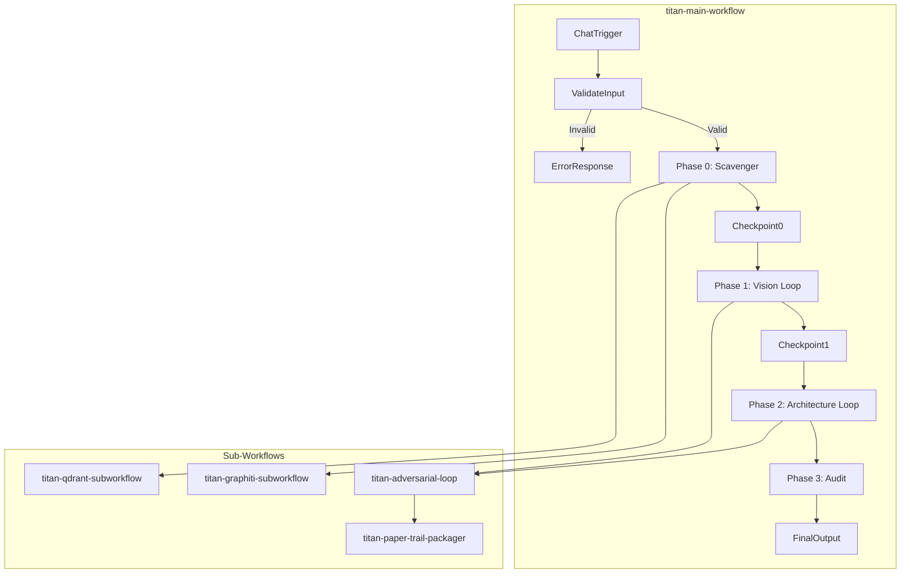

# Titan Workflow Suite - AI Agent Edition v2.5.0

## Latest Update (2026-01-13)

This release includes comprehensive fixes for broken workflow connections and integration issues.

## What's New in v2.2.0

### Critical Fixes
- **Subworkflow Output Connections**: All subworkflows now properly return data to parent workflow via Merge Output nodes
- **Graphiti Workflow**: Fixed dead-end validation nodes, added operation-specific input validation
- **Qdrant Workflow**: Added input validation, fixed UUID generation to proper v4 format, fixed `api-key` header for Qdrant authentication
- **Adversarial Loop**: Removed misleading conditional logic, added output connections from both success/max-iteration paths
- **Error Handling**: All HTTP nodes now use `neverError` mode with proper error capture in validation nodes

### Previous Fixes (v2.1.0)
- Qdrant integration with automatic embedding generation
- Adversarial loop iteration state management
- Environment variables for configurable URLs
- Retry logic for all external API calls
- Input sanitization for security
- Comprehensive telemetry

## Files in This Directory

### Workflow Files
- **`titan-main-workflow.json`** - Main orchestrator workflow
- **`titan-adversarial-loop-subworkflow.json`** - Adversarial agent loop (Creator → Critic → Refiner)
- **`titan-graphiti-subworkflow.json`** - Graphiti knowledge graph operations
- **`titan-qdrant-subworkflow.json`** - Qdrant vector database operations (with embedding generation)
- **`titan-paper-trail-packager-subworkflow.json`** - Iteration history packager for audit trails

### Documentation Files
- **`README.md`** - This file (overview)
- **`AI_AGENT_CONVERSION_GUIDE.md`** - Complete setup and usage guide
- **`CONVERSION_SUMMARY.md`** - Detailed summary of all changes
- **`TESTING_CHECKLIST.md`** - Comprehensive testing guide
- **`TITAN_AGENT_PROMPTS.md`** - Agent prompt templates

## Quick Start

### 1. Prerequisites
- n8n instance (v1.82.0 or higher)
- **OpenRouter API account and key** (for Claude Sonnet 3.5 agents)
- **OpenAI API account and key** (for embedding generation only)
- Google Drive credentials (for document storage)
- Zep account (for agent memory) - [Get free account](https://www.getzep.com/)
- Qdrant instance (optional, for vector storage)
- Graphiti instance (for knowledge graph)

### 2. Environment Variables (Optional)

Set these in n8n UI: **Settings → Environment Variables** (no .env file needed):

```bash
# Service URLs (Docker networking defaults)
GRAPHITI_URL=http://graphiti:8000     # Default
QDRANT_URL=http://qdrant:6333         # Default
QDRANT_API_KEY=your-qdrant-api-key    # Required if Qdrant has auth enabled
OPENAI_API_URL=https://api.openai.com # Default

# Titan Configuration (all optional - sensible defaults used)
TITAN_MAX_ITERATIONS=5                # Max adversarial loop iterations
TITAN_SCORE_THRESHOLD=9.0             # Quality score to pass (0-10)
TITAN_BATCH_SIZE=3                    # Documents processed in parallel
TITAN_AGENT_TIMEOUT=120000            # Agent timeout in ms (2 min)
TITAN_HTTP_TIMEOUT=60000              # HTTP request timeout in ms (1 min)
TITAN_CONFIRMATION_TIMEOUT=86400      # User confirmation timeout in seconds (24h)

# Memory window sizes (messages retained per agent)
TITAN_MEMORY_CREATOR=8
TITAN_MEMORY_CRITIC=6
TITAN_MEMORY_REFINER=10
```

> **Note**: All configuration has sensible defaults. You only need to set variables if you want to override them.

### 3. Setup (5 minutes)

#### Step 1: Create OpenRouter Credential (for AI Agents)
1. Open n8n → Settings → Credentials
2. Click "Add Credential"
3. Select "OpenRouter API"
4. Enter your API key from [openrouter.ai/keys](https://openrouter.ai/keys)
5. Name it: `OpenRouter API`
6. Save

#### Step 2: Create Zep Credential (for Agent Memory)
1. Click "Add Credential"
2. Select "Zep API"
3. Enter your Zep API key and URL
4. Name it: `Zep Api account`
5. Save

#### Step 3: Create OpenAI Header Credential (for Qdrant embeddings)
1. Click "Add Credential"
2. Select "HTTP Header Auth"
3. Header Name: `Authorization`
4. Header Value: `Bearer YOUR_OPENAI_API_KEY`
5. Name it: `OpenAI API Header`
6. Save

#### Step 4: Import Workflows
1. Go to Workflows in n8n
2. Click "Import from File"
3. Import in this order:
   - `titan-graphiti-subworkflow.json`
   - `titan-qdrant-subworkflow.json`
   - `titan-paper-trail-packager-subworkflow.json`
   - `titan-adversarial-loop-subworkflow.json`
   - `titan-main-workflow.json`

#### Step 5: Activate Sub-workflows
1. Open "Titan - Graphiti Operations"
2. Click "Active" toggle
3. Repeat for "Titan - Qdrant Operations"
4. Repeat for "Titan - Paper Trail Packager"
5. Repeat for "Titan - Adversarial Agent Loop"
6. Keep main workflow inactive for now

#### Step 6: Test
1. Open "Titan - Main Orchestrator"
2. Click "Execute Workflow"
3. Provide test inputs in JSON format:
```json
{
  "project_id": "test-project",
  "drive_folder_id": "your-google-drive-folder-id",
  "description": "A test project for validation"
}
```

## Architecture



## Subworkflow Reference

### Titan - Adversarial Agent Loop
**Purpose**: Iterative document refinement using Creator → Critic → Refiner pattern

**Input Parameters**:
| Parameter | Type | Required | Description |
|-----------|------|----------|-------------|
| `task` | string | Yes | The document generation task |
| `context` | string | No | Background context for the agents |
| `creator_prompt` | string | Yes | System prompt for Creator agent |
| `critic_prompt` | string | Yes | System prompt for Critic agent |
| `refiner_prompt` | string | No | System prompt for Refiner (defaults to creator_prompt) |
| `max_iterations` | number | No | Maximum iterations (default: 5) |
| `score_threshold` | number | No | Quality threshold to pass (default: 9) |

**Output**: Final draft, score, iteration history, telemetry

---

### Titan - Graphiti Operations
**Purpose**: Knowledge graph operations for storing and retrieving technical context

**Input Parameters**:
| Parameter | Type | Required | Description |
|-----------|------|----------|-------------|
| `operation` | string | Yes | Operation: `add_episode`, `search_nodes`, `search_facts` |
| `content` / `text` | string | For add_episode | Content to store |
| `query` | string | For search ops | Search query |
| `name` | string | No | Episode name |
| `source` | string | No | Source type (default: "text") |
| `source_description` | string | No | Source description |
| `group_id` | string | No | Group ID (default: "titan") |
| `group_ids` | string | No | Group IDs for search |
| `limit` | number | No | Result limit (default: 10) |

**Output**: Operation result with status, request_id, and data

---

### Titan - Qdrant Operations
**Purpose**: Vector database operations for semantic document search

**Input Parameters**:
| Parameter | Type | Required | Description |
|-----------|------|----------|-------------|
| `operation` | string | Yes | Operation: `upsert`, `search`, `get`, `create_collection` |
| `content` / `text` | string | For upsert | Content to embed and store |
| `query` | string | For search | Search query |
| `id` / `ids` | string | For get | Point ID(s) to retrieve |
| `scope` | string | No | Scope tag (default: "local") |
| `type` | string | No | Document type (default: "document") |
| `source` | string | No | Source identifier |
| `metadata` | string | No | Additional metadata (JSON) |
| `limit` | number | No | Result limit (default: 10) |
| `score_threshold` | number | No | Minimum similarity score (default: 0.7) |
| `with_vectors` | boolean | No | Include vectors in response |

**Output**: Operation result with status, points/results, and count

---

### Titan - Paper Trail Packager
**Purpose**: Packages iteration history from adversarial loops into markdown files for audit trails and documentation

**Input Parameters**:
| Parameter | Type | Required | Description |
|-----------|------|----------|-------------|
| `telemetry` | object | Yes | Telemetry object containing `iteration_history` array |
| `phase` | string | Yes | Phase name (e.g., "vision", "architecture") |
| `session_folder_id` | string | No | Google Drive folder ID for storage |

**Output**: Array of packaged markdown files with:
- Draft documents from Creator iterations
- Critic feedback with scores and evaluations
- Refined drafts from Refiner iterations

**File Naming Convention**:
- `{phase}_draft_iteration_{n}.md` - Creator drafts
- `{phase}_critic_feedback_iteration_{n}.md` - Critic evaluations
- `{phase}_refined_draft_iteration_{n}.md` - Refined versions

**Use Case**: Enables full traceability of document evolution, useful for:
- Quality audits
- Process improvement analysis
- Compliance documentation
- Training data collection

---

## Key Improvements Summary

| Area | Before | After |
|------|--------|-------|
| Subworkflow Output | Dead-end nodes | Proper Merge Output connections |
| Qdrant Integration | Broken auth | Fully functional with api-key header |
| Point IDs | Invalid format | Proper UUID v4 generation |
| Error Handling | None | neverError mode + graceful degradation |
| Input Validation | Partial | Operation-specific field validation |
| Session Keys | Collision-prone | Hash-based unique IDs |
| URLs | Hardcoded | Environment variables |
| Rate Limiting | None | 1s delay + retry backoff |
| Telemetry | None | Full duration tracking |

## Converted Agents

| Agent | Model | Temperature | Memory | Tools | Purpose |
|-------|-------|-------------|--------|-------|---------|
| **Scavenger** | Claude Sonnet 3.5 | 0.2 | Simple (5 msgs) | Graphiti Search | Extract technical standards |
| **Creator** | Claude Sonnet 3.5 | 0.7 | Window (8 msgs) | Graphiti Context | Create initial drafts |
| **Critic** | Claude Sonnet 3.5 | 0.3 | Window (6 msgs) | None | Evaluate and score |
| **Refiner** | Claude Sonnet 3.5 | 0.5 | Window (10 msgs) | Research | Improve drafts |
| **Auditor** | Claude Sonnet 3.5 | 0.2 | Simple | Tech Stack Query | Final quality gate |

> **Note**: All models are accessed via OpenRouter API. You need an OpenRouter API credential configured.

## Cost Considerations

### Model Pricing (OpenRouter - Claude Sonnet 3.5)
- **Claude Sonnet 3.5**: $3.00/M input, $15.00/M output
- **text-embedding-3-small** (OpenAI): $0.02/M tokens

### Estimated Cost Per Run
- **Full workflow**: $0.08 - $0.15 (depending on iterations)
- **Embedding generation**: ~$0.001 per document

### Cost Optimization Tips
- Use Claude Haiku for Scavenger/Auditor to reduce costs by ~70%
- Reduce max iterations from 5 to 3 if quality threshold is reached early
- Enable prompt caching for repeated system prompts

## Troubleshooting

### "Credential not found"
**Solution**: Create credentials named exactly as specified:
- `OpenAI API` for agents
- `OpenAI API Header` for embeddings

### "Validation Error: Missing Google Drive folder ID"
**Solution**: Provide folder ID in your input:
```json
{"drive_folder_id": "1abc123def456"}
```

### "Embedding generation failed"
**Solution**: Check OpenAI API Header credential has correct Bearer token

### "Graphiti connection refused"
**Solution**: 
1. Verify Graphiti is running
2. Check `GRAPHITI_URL` environment variable
3. Default is `http://graphiti:8000`

### "Tool execution failed"
**Solution**: Ensure sub-workflows are activated

### "Subworkflow returns no data"
**Solution**: This was fixed in v2.2.0. All subworkflows now have proper output connections via Merge Output nodes. Re-import the workflow files.

### "Qdrant authentication failed"
**Solution**: 
1. Set `QDRANT_API_KEY` environment variable in n8n
2. The workflow uses `api-key` header (not Authorization header)

### "Invalid point ID format"
**Solution**: Fixed in v2.2.0. The workflow now generates proper UUID v4 format IDs for Qdrant points.

## Performance

### Expected Response Times
- **Scavenger**: 10-30 seconds
- **Creator**: 30-60 seconds
- **Critic**: 10-20 seconds
- **Refiner**: 30-60 seconds
- **Auditor**: 15-30 seconds

### Full Workflow
- **Phase 0 (Scavenger)**: 2-5 minutes
- **Phase 1 (Vision)**: 5-15 minutes (2-3 iterations)
- **Phase 2 (Architecture)**: 5-15 minutes (2-3 iterations)
- **Phase 3 (Audit)**: 1-3 minutes
- **Total**: 15-40 minutes

## Support Resources

- **n8n Documentation**: https://docs.n8n.io/advanced-ai/
- **OpenAI API Docs**: https://platform.openai.com/docs
- **Qdrant Documentation**: https://qdrant.tech/documentation/
- **n8n Community**: https://community.n8n.io/

## Version History

### v2.5.0 (2026-01-13) - Subworkflow Input Schema Fix
- **BREAKING**: All subworkflows now require explicit input schema (n8n v1.82+ compatibility)
- Added `workflowInputs` schema to all `executeWorkflowTrigger` nodes
- Fixed Paper Trail Packager: changed from `manualTrigger` to `executeWorkflowTrigger`
- Added comprehensive subworkflow reference documentation to README
- Updated architecture diagram to include Paper Trail Packager

### v2.4.0 (2026-01-13) - Production Hardening & Optimization
- **Credential Portability**: Removed all hardcoded credential IDs - workflows now deploy to any n8n instance
- **Enhanced Security**: Comprehensive input sanitization (XSS, template injection, JavaScript protocol, event handlers)
- **Retry Logic**: Added 3-retry with 1s interval to all Graphiti and Qdrant HTTP nodes (HTTP 500/429)
- **UUID v4 Session IDs**: Replaced weak hash-based IDs with proper UUID v4 format
- **Parser Resilience**: Critic response parser now has 4 fallback strategies for JSON extraction
- **Configuration System**: Added `TITAN_*` environment variables with sensible defaults (no .env required)
- **Documentation**: Corrected model info (Claude Sonnet 3.5 via OpenRouter, not GPT-4)

### v2.3.0 (2026-01-13) - User Confirmation Flow Fix
- **BREAKING**: Replaced Form nodes with Wait nodes for user confirmations
- Form nodes require a Form Trigger at workflow start, but this workflow uses Chat Trigger
- User Standard Confirmation now uses Wait node with webhook resume
- Tech Promotion Confirmation now uses Wait node with webhook resume
- Added preparation nodes that output confirmation details and webhook URLs
- Users can approve by sending POST `{"approve": true}` to the webhook URL

### v2.2.0 (2026-01-13) - Workflow Connection Fixes
- Fixed all subworkflow output connections (dead-end nodes now connect to Merge Output)
- Fixed Graphiti workflow: operation-specific validation, HTTP error handling with neverError mode
- Fixed Qdrant workflow: proper UUID v4 generation, api-key header authentication, conditional filter in search
- Fixed Adversarial Loop: removed dead "Is First Run?" branch, added output connections
- All workflows now properly return data to parent workflow

### v2.1.0 (2026-01-13) - Comprehensive Improvements
- Fixed Qdrant integration with embedding generation
- Fixed adversarial loop iteration state
- Added input validation and error handling
- Added environment variables for URLs
- Added rate limiting and retry logic
- Added checkpoints and telemetry
- Enabled parallel operations
- Added input sanitization

### v2.0.0 (2026-01-13) - AI Agent Conversion
- Converted all agents to AI Agent nodes
- Added OpenAI Chat Models
- Implemented memory
- Added workflow tools

### v1.0.0 (2026-01-12) - Initial Release
- HTTP-based agents with OpenRouter
- Gemini 2.0 Flash models

## License

See main project license.

---

**Ready to get started?** Follow the setup instructions above, then run your first workflow!
